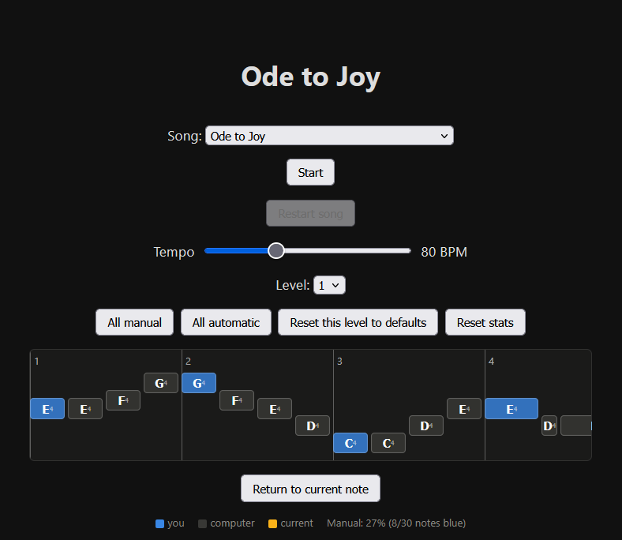

# First Note Piano

## Learn the song before you realize you're learning it

First Note Piano turns piano practice into a handoff between automatic
movement and conscious attention.

The computer plays most of the song, then pauses at selected notes. You find
the key and the music continues immediately. As you improve, more notes become
yours until you're playing the entire melody yourself.

There is no score, deadline, penalty, or single correct way to explore. Wrong
keys simply sound and leave you where you are. Your hands learn through
repetition, listening, and discovery rather than pressure.

What makes it different is the gradual transfer of responsibility. Instead of
asking you to perform the whole song before you're ready, it gives you a small,
manageable part and expands that part as your confidence grows. Two-hand
arrangements can begin with an extremely simple bass pattern, then add movement
one step at a time.

You can customize any song note by note, slow the tempo, practise either hand,
and review which individual notes still need attention. The app remembers your
choices and tracks progress without interrupting the experience.

It is useful for beginners building physical fluency, returning players
rebuilding confidence, and anyone curious about how deliberate practice becomes
automatic skill.

You don't have to force yourself to master the whole keyboard. You just have to
take your turn.

### Name alternatives

    python -m http.server 8000

Open <http://localhost:8000/> in Chrome or Edge, plug in the MIDI keyboard,
click Start, and grant MIDI permission when asked.

Use **Song** to choose **Ode to Joy**, **Twinkle, Twinkle, Little Star**, or
**Twinkle — two hands (easy left hand)**.
Twinkle adds A4, larger pitch jumps, and a longer melody at the same tempo.
The two-hand arrangement keeps that melody in the right hand and adds just
one C3 per bar in the left hand (one octave below middle C). Tap it; holding
the key is not required. Hover over a note to see which hand plays it.
When multiple manual notes start together, play them together or in either
order; playback waits until all are accepted. Each hand's notes can be toggled
individually. Sustained bass notes do not delay the next melody note.
Changing songs returns playback and the visualization to the beginning.
For the next step, choose **Ode to Joy — two hands (moving left hand)**.
The left hand still plays only once per bar, now using C3 and G3. The right
hand uses the familiar Ode to Joy melody, including its dotted rhythms.
The tempo starts at 80 BPM. Use the **Tempo** slider to adjust it from 40 to
160 BPM. Changes apply to subsequent notes without restarting the song;
manual notes still wait for your input.
Click notes to switch between manual (blue) and automatic playback; custom
patterns are saved in this browser separately for each song and level.
**Reset this level to defaults** restores only the selected song's current level.

The computer plays the selected song but stops at player-owned notes and waits
indefinitely. Wrong keys sound and do nothing; the correct key resumes the song.
Finishing the song pauses for review until **Restart song** or the keyboard's
**A0** restart key is pressed. Each level hands over one more beat per
measure (P C C C -> P P C C -> P P P C -> P P P P).

Computer-played notes always sound through the computer's speakers, and are also
sent to the piano when it appears as a MIDI output. Player key presses are also
synthesized through the computer's speakers.

Run playback regression checks with `node --test tests/playback.test.cjs`.

After each completed attempt, statistics appear directly on the existing notes
without changing their size or layout. A red dot marks a key with an incorrect
press for that specific note occurrence during the attempt. A red/green bar shows
the all-time wrong/correct balance for that same note occurrence;
its length grows on a log scale and reaches full length at about 30 attempts.
Hover a dot or bar for exact correct/wrong counts. Totals are saved locally per
song and note occurrence across sessions, including attempts you restart. A wrong
press is assigned to the current expected note occurrence; count-in and
automatic-playback input are ignored. Accuracy runs from red (0%) to green (100%);
unplayed keys show a dash. Restarting removes the overlays and restores the
normal note layout. Playback does not restart automatically.
**Reset stats** clears current and saved statistics without changing note patterns.
